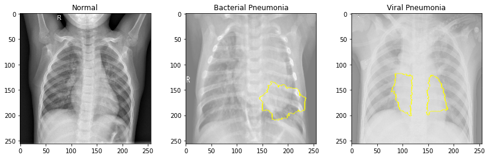

# Phase_4_Project


**Author:** Benjamin Toler

## Overview
This project used nearly 6,000 pediatric xray images from the Guangzhou Women and Children’s Medical Center to develop an image classification model that can accurately identify the presence of pneumonia. The model has been developed for a local hospital that is looking to increase their efficiency and accuracy in diagnosing pneumonia in order to improve patient experience and outcome. The data was processed using ImageDataGenerator from the keras library, and then split into training, validation, and test datasets. The training set was further split into a smaller training set for faster processing on initial modeling iterations. The project uses convolutional neural networks from the keras library. Over several iterations, the model complexity of the model architecture is adjusted through the number of layers, the number of convolutional filters, and the number of neurons. Additionally, several regularization techniques are applied to reduce overfitting. The final CNN model showed a 96% accuracy in detecting pneumonia.

## Business Problem
A local hospital is looking to improve the efficiency and accuracy in which they diagnose pediatric pneumonia. By doing so, they will be able to decrease diagnostic error and limit patient wait times. This will improve overall patient experience.

## Data
The data for this project comes from the Guangzhou Women and Children’s Medical Center. It consists of 5,956 chest x-ray images of patients ages 1-5. The dataset has a class imbalance of 73% negative and 27% positive.


## Method


## Results




## Conclusions
- **Use model in evaluating potential pneumonia patients:** With a 96% accuracy, the model should be used in conjunction with the standard manual diagnosis process to help reduce errors in pneumonia detection.
- **Run model for all chest xrays:** The model should be run for all chest xrays, not just when pneumonia is expected. This will prevent missing it in cases where the doctors may not be closely looking for it.
- **Use model to train hospital doctors:** The model can be used to train doctors where to look for pneumonia and what to look for.

## Next Steps
- **Test model on adult chest xrays:** the current model was built to identify pneumonia in pediatric patients ages 1-5. Future models should be generalized to work for all age groups.
- **Further hyperparameter and architecture tuning to see if accuracy can be further improved:** due to the processing time needed for these models, only so much variable and architecture tuning was possible. Further tuning may improve the model.
- **Create multi-class model that can identify other conditions/diseases in the chest xray:** Having a classification model that can identify multiple conditions that can be seen on a chest xray will further improve efficiency in the hospital.

## For More Information

See the full analysis in the [Jupyter Notebook](./Chest_Xray_Pneumonia_Classification.ipynb) or review this [presentation](./presentation.pdf).

For additional info, contact Benjamin Toler at [bentoler22@gmail.com](mailto:bentoler22@gmail.com)


## Repository Structure

```
├── data
├── images
├── .gitignore
└── Chest_Xray_Pneumonia_Classification.ipynb
├── README.md
├── presentation.pdf
